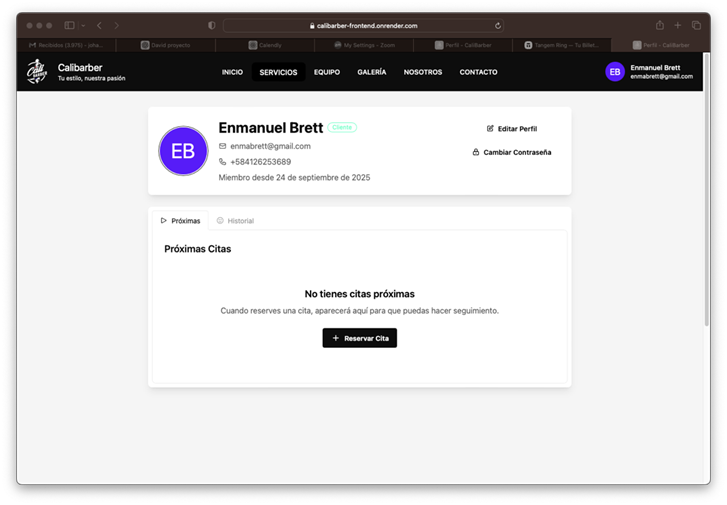
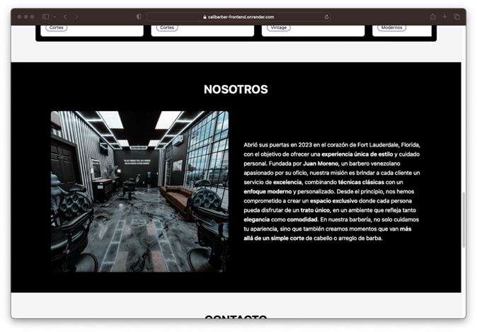
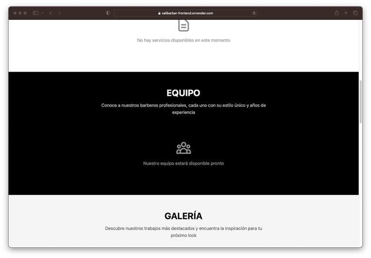
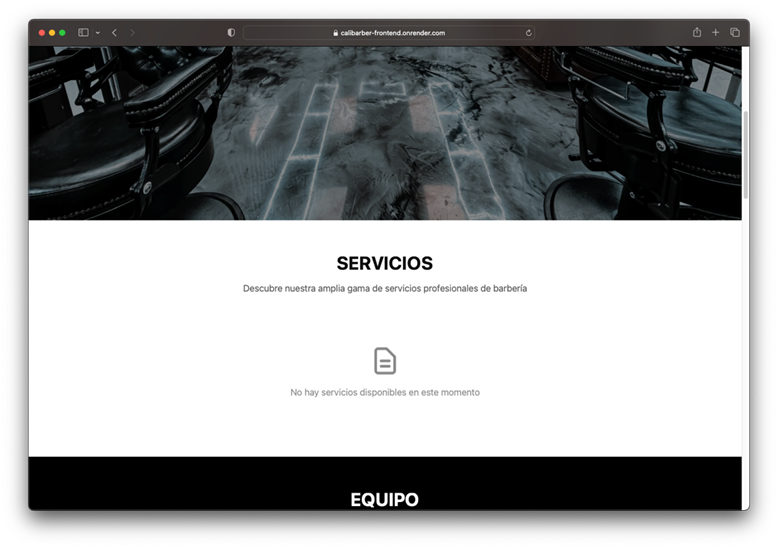
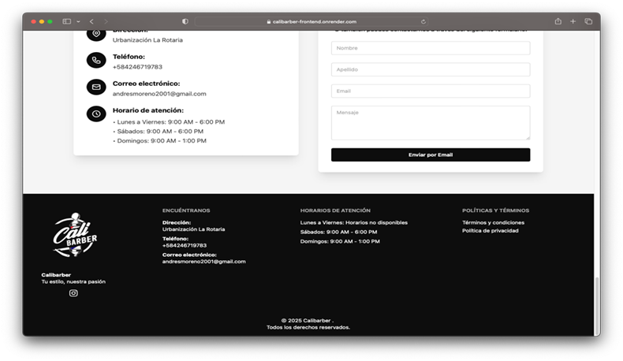

# Calibarber — Aplicación Web para Barberías

<p align="center">
  
</p>

<p align="center">
  
  
  
  
  
  
</p>

Calibarber Frontend es la aplicación web en Angular que consume la API REST del backend. Hace parte del proyecto completo junto con el backend en Spring Boot: https://github.com/andresmtataseo/Calibarber-Backend.

## Tabla de Contenidos
- Descripción General
- Tecnologías Utilizadas
- Arquitectura y Módulos
- Funcionalidades Clave
- Configuración de Entorno
- Desarrollo
- Construcción
- Capturas de Pantalla del Sistema
- Integración con el Backend

## Descripción General
Aplicación SPA (Single Page Application) construida con Angular CLI 20.x que permite a usuarios registrarse, iniciar sesión, gestionar perfiles, explorar barberías y servicios, programar citas y visualizar pagos e historial. Está diseñada para integrarse de forma segura y eficiente con la API de Calibarber Backend.

## Tecnologías Utilizadas
- Angular CLI 20.1.3
- TypeScript
- RxJS
- HTML/CSS
- Herramientas de build y scripts personalizados (`build-production.js`, `load-env.js`)

## Arquitectura y Módulos
Estructura modular por características (`feature-based`), alineada con el backend:
- `features/auth`: autenticación (sign-in, sign-up, change-password)
- `features/user`: gestión de usuarios y perfiles
- `features/barbershop`: exploración y gestión de barberías
- `features/barber`: disponibilidad y especialidades de barberos
- `features/service`: catálogo y detalles de servicios
- `features/appointment`: creación, cancelación y reprogramación de citas
- `features/payment`: registro y visualización de pagos
- `core`: configuración, interceptores, guards, servicios base y tipos
- `shared`: componentes, pipes, directivas, modelos y utilidades reutilizables

## Funcionalidades Clave
- Autenticación JWT con persistencia de sesión
- Protección de rutas con guards e interceptores
- Gestión de usuarios (perfil, roles, activación/desactivación)
- Búsqueda y filtrado de barberías y servicios
- Programación de citas con validaciones
- Manejo de estados de carga, error y vacíos
- Navegación con rutas modulares y lazy loading

## Configuración de Entorno
Usa variables de entorno para apuntar al backend y otros ajustes.

Archivos relevantes:
- `.env.example`: plantilla de variables
- `src/environments/environment.ts`: configuración por ambiente

Ejemplo de `.env`:
```
API_BASE_URL=http://localhost:8080/api/v1
APP_NAME=Calibarber
```

Ajusta `API_BASE_URL` según tu entorno y habilita CORS en el backend si es necesario.

## Desarrollo
Instalación y servidor de desarrollo:
```bash
npm install
ng serve
```

Accede a `http://localhost:4200/`. La aplicación recarga automáticamente ante cambios.

## Construcción
Genera build de producción optimizada:
```bash
ng build
```
Los artefactos quedan en `dist/`. Puedes usar `build-production.js` si tu flujo lo requiere.

## Capturas de Pantalla del Sistema

### 🔐 Autenticación y Registro
Funcionalidades de acceso y gestión de cuentas de usuario.

| Pantalla | Descripción |
|----------|-------------|
|  | **Inicio de Sesión**: Formulario de autenticación con validación de credenciales y manejo de errores. |
|  | **Registro de Usuario**: Formulario de registro con validaciones en tiempo real y confirmación de contraseña. |
|  | **Cambio de Contraseña**: Interfaz segura para actualizar credenciales con validación de contraseña actual. |

### 👤 Gestión de Perfil
Administración de información personal y configuración de cuenta.

| Pantalla | Descripción |
|----------|-------------|
|  | **Perfil de Usuario**: Vista del perfil personal con información básica y opciones de configuración. |
|  | **Edición de Perfil**: Formulario para actualizar datos personales con validaciones y vista previa. |
|  | **Confirmación de Registro**: Notificación de éxito tras la creación exitosa de una nueva cuenta. |

### 🏪 Reservas y Citas
Sistema completo de programación y gestión de citas.

| Pantalla | Descripción |
|----------|-------------|
|  | **Reservar Cita - Paso 1**: Selección de barbería, servicio y fecha disponible con calendario interactivo. |
|  | **Reservar Cita - Paso 2**: Confirmación de detalles, selección de barbero y finalización de la reserva. |
|  | **Confirmación de Cita**: Notificación de éxito con detalles de la cita programada y opciones de gestión. |

### ⚙️ Panel de Administración
Herramientas administrativas para gestión completa del sistema.

| Pantalla | Descripción |
|----------|-------------|
|  | **Dashboard Administrativo**: Panel principal con métricas, estadísticas y accesos rápidos a funciones de gestión. |
|  | **Gestión de Usuarios**: CRUD completo de usuarios con filtros, búsqueda y asignación de roles. |
|  | **Gestión de Barberías**: Administración de establecimientos con información, horarios y configuración. |
|  | **Gestión de Barberos**: Control de profesionales, especialidades, horarios y disponibilidad. |
|  | **Gestión de Servicios**: Catálogo de servicios con precios, duración y categorización. |
|  | **Gestión de Citas**: Vista administrativa de todas las citas con filtros y opciones de modificación. |

### 🏠 Páginas Públicas
Contenido informativo y de presentación del negocio.

| Pantalla | Descripción |
|----------|-------------|
|  | **Página de Inicio**: Landing page con hero section, servicios destacados y llamadas a la acción. |
|  | **Acerca de Nosotros**: Información corporativa, misión, visión y valores de la empresa. |
|  | **Nuestro Equipo**: Presentación del equipo de barberos con especialidades y experiencia. |
|  | **Galería de Trabajos**: Showcase visual de trabajos realizados y estilos disponibles. |
|  | **Catálogo de Servicios**: Lista detallada de servicios con precios, duración y descripciones. |
|  | **Contacto**: Formulario de contacto, ubicación, horarios y información de contacto. |

### 📄 Páginas Legales
Información legal y políticas de la plataforma.

| Pantalla | Descripción |
|----------|-------------|
|  | **Política de Privacidad**: Documento legal sobre manejo y protección de datos personales. |
|  | **Términos y Condiciones**: Condiciones de uso de la plataforma y acuerdos legales. |

### 🎨 Componentes UI
Elementos de interfaz y componentes reutilizables.

| Pantalla | Descripción |
|----------|-------------|
|  | **Footer**: Pie de página con enlaces importantes, redes sociales e información de contacto. |

## Integración con el Backend
- Backend del proyecto: https://github.com/andresmtataseo/Calibarber-Backend
- Autenticación: encabezado `Authorization: Bearer <token>` para endpoints protegidos
- Rutas y contratos: mantener consistencia con la documentación Swagger del backend
- Errores: interceptores capturan respuestas HTTP y muestran mensajes adecuados
